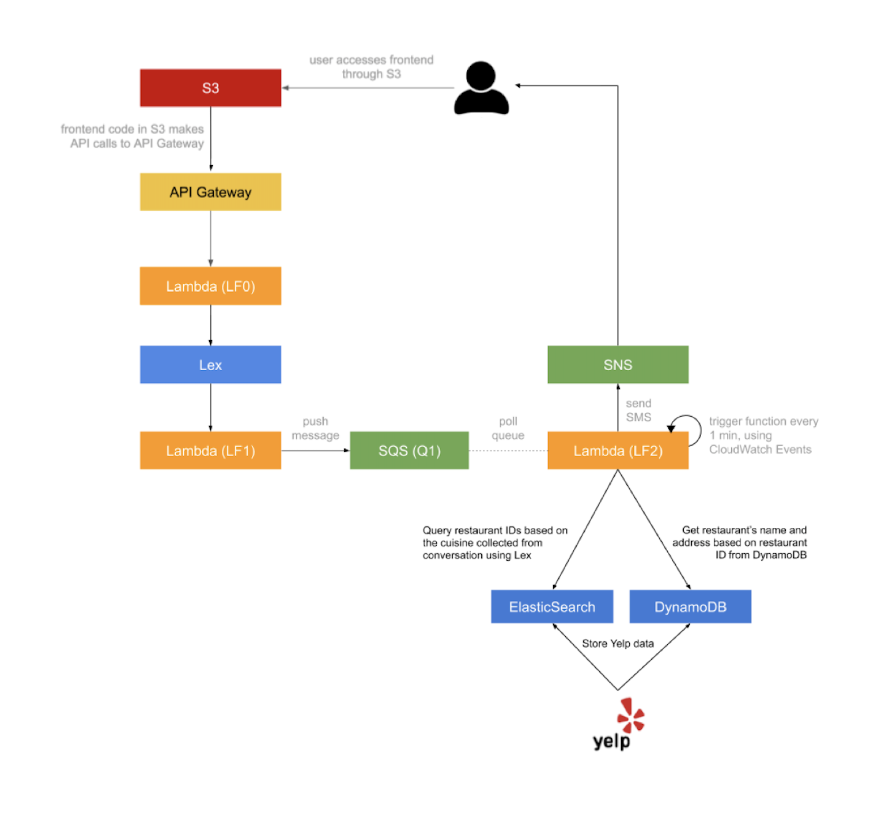

# Dining_Concierge

Customer Service is a core service for a lot of businesses around the world and it is getting disrupted at the moment by Natural Language Processing-powered applications. In this application, we have implemented a serverless, microservice-driven web application.
We have developed a dining concierge chatbot, which learns the user preference of cuisines, date, time and sends out an SMS with restaurant suggestions to the phone number provided by the user.

### Architecture Diagram

